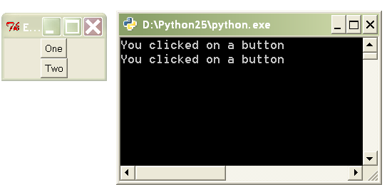
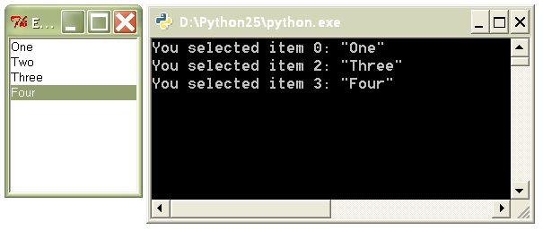

==========
Decorators
==========

.. contents:: :local:

Getting Started
===============

Simple decorators
-----------------
.. sourcecode:: python

    def decorator(func):
        print 'name:', func.__name__
        print '# arguments:', func.func_code.co_argcount
        print '-' * 80
        return func

    @decorator
    def func1(a, b, c):
        print a, b, c

    @decorator
    def func2(w, x, y, z):
        print w, x, y, z

Expected output::

    name: func1
    # arguments: 3
    --------------------------------------------------------------------------------
    name: func2
    # arguments: 4
    --------------------------------------------------------------------------------

This is a simple decorator that accepts no arguments. It is standard practice to have a decorator return a function (though it's not required). If you are not planning on transforming a function, then just return the same function that was passed in.

In this particular decorator, all we do is print the name of the target function and the number of arguments it takes. Note that we didn't have to invoke either of the functions for that information to be printed.

Keep in mind that the ``@`` syntax is not strictly necessary, it's just syntactic sugar. To apply the decorator, you could have written:

.. sourcecode:: python

    func1 = decorator(func1)

Decorators that transform
-------------------------
.. sourcecode:: python

    import time

    def decorator(func):
        def newfunc(*args):
            startTime = time.time()
            result = func(*args)
            endTime = time.time()
            print 'Took %f seconds to run' % (endTime - startTime)
            return result

        return newfunc

    @decorator
    def sum_of_range(start, stop, step):
        return sum(i for i in xrange(start, stop, step))

    print sum_of_range(345, 9999999, 3)

Expected output::

    Took 1.172000 seconds to run
    16666658313669

This decorator replaces a function with a new function that does the the same thing but also prints the duration of execution. Inside the ``decorator`` function we create a new function called ``newfunc``. Inside ``newfunc``, ``func`` is invoked with the same arguments that were received by ``newfunc``.

Decorator methods
-----------------
.. sourcecode:: python

    class Template(object):
        def __init__(self, message):
            self.message = message

        def __call__(self, func):
            def newfunc(*args):
                return self.message % func(*args)
            return newfunc

    @Template('%s your %s are belong to %s')
    def func1(quantity, object, group):
        return quantity, object, group

    print func1('All', 'base', 'us')

We can create a callable object that acts as the decorator. This is a common method of creating decorators that accept non-function input.

In this example, the original function only returns a tuple. But after being transformed by the decorator, it now returns a string.

The following is an equivalent way to apply our decorator method:

.. sourcecode:: python

    func1 = Template('%s your %s are belong to %s')(func1)


Decorators that return decorators
---------------------------------
.. sourcecode:: python

    def template(message):
        def decorator2(func):
            def newfunc(*args):
                return message % func(*args)
            return newfunc

        return decorator2

    @template('%s your %s are belong to %s')
    def func1(quantity, object, group):
        return quantity, object, group

    print func1('All', 'base', 'us')

Expected output::

    All your base are belong to us

OK, things are getting a little tricky now. This example is equivalent to the last one, except that we are using nested functions and closures to achieve the same affect.

This is the rule: A decorator that does not accept a single function argument must return another decorator. This returned decorator is then applied to the function.

The following is an equivalent way to apply our decorator:

.. sourcecode:: python

    func1 = template('%s your %s are belong to %s')(func1)

As a side note, decorators that return decorators almost always use closures.

Applying multiple decorators
----------------------------
.. sourcecode:: python

    def decorator1(func):
        print 'Inside decorator1'
        return func

    def decorator2(func):
        print 'Inside decorator2'
        return func

    @decorator1
    @decorator2
    def func1(a, b, c):
        return a, b, c

    print func1('All', 'base', 'us')

Expected output::

    Inside decorator2
    Inside decorator1
    ('All', 'base', 'us')

Python gives a nice syntax for applying multiple decorators. When we use this syntax, we often say that we are "stacking decorators". Note that the decorators are applied in the opposite order in which they were stacked.

The non-nice way to applying multiple decorators looks like this:

.. sourcecode:: python

    func1 = decorator1(decorator2(func1))

Hopefully, this will help you remember why you should return a function inside a decorator -- if you don't, then the next decorator in the stack won't have a function to apply itself to.

What Exactly Are Decorators?
============================

A decorator is either:

- A callable that accepts a function
- A callable that accepts some arguments and returns a decorator

Any callable can be a decorator. That means functions, methods, and objects that implement the magic method ``__call__``.

Although decorators have been in Python for a long time, the special decorator syntax using ``@`` was not added to Python until version 2.4. So stay away from earlier versions of Python if you want to make extensive use of decorators.

Use Cases
=========

Event Handling
--------------
.. _Pyglet: http://pyglet.org/

Pyglet_ is a multimedia framework that is useful for making games. It gives you an easy way to do event handling through the ``Window.event`` decorator method. Attaching ``Window.event`` to a function causes that function to respond to a particular window event.

.. sourcecode:: python

    from pyglet import window
    from pyglet.gl import *

    win = window.Window()

    @win.event
    def on_key_press(symbol, modifiers):
        print symbol, modifiers

    @win.event
    def on_mouse_press(x, y, button, modifiers):
        print x, y, button, modifiers

    @win.event
    def on_resize(width, height):
        glClearColor(0.2, 0.6, 0.3, 1)

Which event does a function get attached to? The ``Window.event`` decorator decides this by looking at the name of the function (available through the ``__name__`` magic attribute).

Pyglet also lets you bind event callbacks using a more traditional API:

.. sourcecode:: python

    win = window.Window()

    def on_key_press(symbol, modifiers):
        print symbol, modifiers
    win.on_key_press = on_key_press

    def on_mouse_press(x, y, button, modifiers):
        print x, y, button, modifiers
    win.on_mouse_press = on_mouse_press

    def on_resize(width, height):
        glClearColor(0.2, 0.6, 0.3, 1)
    win.on_resize = on_resize

As you can see, this version uses the same number of lines, but is more redundant and not as easy to read.

Adding Metadata to a Function
-----------------------------
TurboGears_ is a full stack web framework. In TurboGears, the ``expose`` decorator essentially causes a method to be mapped to a URL. For example, navigating to ``http://localhost/pagelist`` causes the exposed ``pagelist`` method to be invoked.

.. sourcecode:: python

    from turbogears import controllers, expose

    class Root(controllers.RootController):
        @expose
        def index(self, pagename="FrontPage"):
            page = Page.byPagename(pagename)
            content = 'Salutations, Friend'
            return content

        @expose
        def pagelist(self):
            pages = [page.pagename for page in Page.select()]
            return '<br>'.join(str(p) for p in pages)

Part of how ``expose`` works is to set or modify attributes on the target function. For example, the ``exposed`` attribute is set to ``True`` to let the framework know which methods are to exposed to the Web and which are just "private" methods. Also, since multiple ``expose`` decorators might be used on a method, the information for each one is appended to the ``_ruleinfo`` attribute.

.. _TurboGears: http://turbogears.org
.. _Model-View-Controller: http://en.wikipedia.org/wiki/Model_view_controller
.. _JSON: http://en.wikipedia.org/wiki/Json

Transforming a Function
-----------------------
TurboGears's ``expose`` decorator also allows you to attach a template to a method. This alters the behavior of the method. In the following example, the ``index`` method returns a dictionary inside its body. However, the ``expose`` decorator causes it to return a string instead.

.. sourcecode:: python

    from turbogears import controllers, expose

    class Root(controllers.RootController):
        @expose(template="wiki20.templates.page")
        def index(self, pagename="FrontPage"):
            page = Page.byPagename(pagename)
            content = 'Salutations, Friend'
            return dict(data=content, page=page)

        @expose(template="wiki20.templates.pagelist")
        @expose("json")
        def pagelist(self):
            pages = [page.pagename for page in Page.select()]
            return dict(pages=pages)

Templates in this context are usually HTML pages with "holes" in them; the holes are filled by the values in the dictionary returned by the original function. In the context of the Model-View-Controller_ pattern, decorators provide the "glue" that connects views to controllers.

The ``Root.pagelist`` method shows that you can stack decorators on top of each other. The top invocation, ``@expose(template="wiki20.templates.pagelist")`` exposes the method and assigns a template to it. The bottom invocation, ``@expose("json")``, allows the method to render its output in JSON_ format. If you navigate to ``http://localhost/pagelist?tg_format=json``, you'll see JavaScript instead of a web page.

Although a decorator certainly can modify a function, that's not what usually happens. Most likely the original function has been substituted for another function (and this substituted function probably makes use of the original function). That's why we usually say that a decorator *transforms* its target function.

Decorators work with both functions and methods.  Just remember that even though we keep talking about functions, we really mean functions *and* methods.

Recipes
=======

Custom Event Binding
--------------------
In this recipe, we explore ways to bind callbacks to an event that we create. Specifically, we create a class ``Downloader`` that has a ``done`` event that gets fired when all downloads have completed. A naive implementation might involve creating a ``done_callback`` attribute, then assigning a function to it:

.. sourcecode:: python

    downloader = Downloader(url_list)

    def ondone(num_downloaded, time_elapsed):
        print "Fetched", num_downloaded, "files in", time_elapsed, "seconds"

    downloader.done_callback = ondone

    downloader.start_downloads()

Once we're done fully implementing our recipe, we'll be able to bind and define our callbacks in a single step. Not only that, we'll have the ability to bind multiple callbacks to the ``done`` event:

.. sourcecode:: python

    downloader = Downloader(url_list)

    @downloader.done
    def _(count, time_elapsed):
        print "Fetched", count, "files in", time_elapsed, "seconds"

    @downloader.done
    def _(count, time_elapsed):
        print '%s downloaded in %0.3f minutes' % (count, time_elapsed / 60.0)

    downloader.start_downloads()

Prerequisites
`````````````
- threading.Thread_ class

.. _threading.Thread: https://docs.python.org/2/library/threading.html#threading.Thread

Steps
`````
- :doc:`Downloader Step 0 <downloader/step0>`
- :doc:`Downloader Step 1 <downloader/step1>`
- :doc:`Downloader Step 2 <downloader/step2>`
- :doc:`Downloader Step 3 <downloader/step3>`

Event Binding in Tkinter
------------------------
.. _Tkinter: http://docs.python.org/lib/module-Tkinter.html

Tkinter_ is the default GUI toolkit for Python. It's great! Well, it's not great, per se, but it ships with Python, so it's probably sitting on your system somewhere, ready to be used. So let's use it! Here's an example of binding a callback function to a button widget:

.. sourcecode:: python

    from Tkinter import *

    def onclick():
        print 'You clicked on a button'

    frame = Frame()
    frame.master.title("Event binding with decorators")
    frame.pack()

    btn1 = Button(frame, text="One")
    btn1.pack()

    btn2 = Button(frame, text="Two")
    btn2.pack()

    btn1['command'] = onclick
    btn2['command'] = onclick

    frame.mainloop()

The resulting GUI program:



Tkinter has a pretty simple event binding mechanism for buttons: just assign the ``command`` item to the callback function. However, notice that you have to first define the function, then bind it to the button's command event. Why can't we define and bind at the same time?

Once you've properly implemented this recipe, you'll be able to write the following:

.. sourcecode:: python

    btn1 = MyButton(frame, text="One")
    btn1.pack()

    btn2 = MyButton(frame, text="Two")
    btn2.pack()

    @btn1.command
    @btn2.command
    def onclick(target):
        print 'You clicked on button <%s>' % target['text']

The resulting code is more cohesive than the original.

The first solution to event binding that we describe involves subclassing Tkinter's ``Button`` class. However, this isn't necessarily a great idea because we probably don't want to subclass every single widget in Tkinter. Instead, we can use a decorator function:

.. sourcecode:: python

    lb = Listbox(frame, name='lb')
    for s in ['One', 'Two', 'Three', 'Four']:
        lb.insert(END, s)
    lb.pack()

    @bind(lb, '<<ListboxSelect>>')
    def onselect(evt):
        w = evt.widget
        index = int(w.curselection()[0])
        value = w.get(index)
        print 'You selected item %d: "%s"' % (index, value)

The resulting GUI program:



In the above example, we bind the ``onselect`` function to the ``ListboxSelect`` event on the ``lb`` object.

Prerequisites
`````````````
- closures_
- A `basic familiarity`_ with Tkinter

.. _basic familiarity: http://effbot.org/tkinterbook/tkinter-index.htm#introduction

Steps
`````
- :doc:`Tkinter Step 0 <tkinter/step0>`
- :doc:`Tkinter Step 1 <tkinter/step1>`
- :doc:`Tkinter Step 2 <tkinter/step2>`
- :doc:`Tkinter Step 3 <tkinter/step3>`

Decorator Caveats
=================

Can make a mess of your code
----------------------------
Using a lot of decorators can make your code fairly convoluted. Decorators that transform other functions usually need to use nested functions. Too much nesting of functions can really make a mess of your code. If you find yourself writing tons of nested functions, ask yourself if there isn't a simpler way to do it. In many cases, metaclasses can be used in place of decorators, since a metaclass is very much like a "decorator" that acts on classes. So if you have a set of related functions that all need to be transformed in some way, consider grouping them into methods under a single class and then writing a metaclass.

Be nice to the decorated function
---------------------------------
If you return a new function in place of an old one, you run the risk of confusing something else in the program that expected attributes from the original function.  For example, if you use a discovery based test runner that looks for methods prefixed with "test" then you will need to copy the ``func.__name__`` attribute in your decorated function.  In Python 2.5, the builtin ``@functools.wraps(func)`` is a decorator that returns a function to *look* like ``func`` and is meant to solve this problem.

:doc:`Exercises <exercises>`

:doc:`Go Back <../index>`
