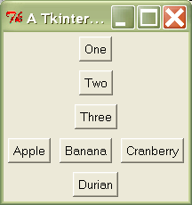

=============
Magic Methods
=============

.. contents:: :local:


Getting Started
===============

There are far more magic methods in Python than we could ever hope to cover. However, we believe that the arithmetic and boolean magic methods are fairly intuitive to use, and so don't deserve special attention. The really common magic methods, such as ``__str__``, ``__repr__``, and ``__unicode__``, are already covered in any decent Python tutorial. In this short tutorial, we'll focus on three magic methods that are often overriden in various frameworks we've encountered: ``__getitem__``, ``__call__``, and ``__getattr__``.

Introducing __getitem__
-----------------------
Implementing ``__getitem__`` in a class allows its instances to use the ``[]`` (indexer) operators.

.. sourcecode:: python

    class Test(object):
        def __getitem__(self, items):
            print '%-15s  %s' % (type(items), items)

    t = Test()
    t[1]
    t['hello world']
    t[1, 'b', 3.0]
    t[5:200:10]
    t['a':'z':3]
    t[object()]

Expected output::

    <type 'int'>     1
    <type 'str'>     hello world
    <type 'tuple'>   (1, 'b', 3.0)
    <type 'slice'>   slice(5, 200, 10)
    <type 'slice'>   slice('a', 'z', 3)
    <type 'object'>  <object object at 0x00C10468>

Unlike some other languages, Python basically lets you pass any object into the indexer. You may be surprised that ``t[1, 'b', 3.0]`` actually parses. To the Python interpreter, that expression is equivalent to this: ``t.__getitem__((1, 'b', 3.0))``. As you can see, the ``1, 'b', 3.0`` part is implicitly parsed as a tuple.

The ``t[5:200:10]`` expression makes use of Python's slice syntax. It is equivalent to this expression: ``t[slice(5, 200, 10)]``. The

The ``__getitem__`` magic method is usually used for list indexing, dictionary lookups, or accessing ranges of values. Considering how versatile it is, it's probably one of Python's most underutilized magic methods.

Introducing __call__
--------------------
Implementing the ``__call__`` magic method in a class causes its instances to become callables -- in other words, those instances now behave like functions. You can use the built-in function ``callable`` to test if a particular object is a callable (``callable`` returns ``True`` for functions, methods, and objects that have ``__call__``).

.. sourcecode:: python

    class Test(object):
        def __call__(self, *args, **kwargs):
            print args
            print kwargs
            print '-'*80

    t = Test()
    t(1, 2, 3)
    t(a=1, b=2, c=3)
    t(4, 5, 6, d=4, e=5, f=6)

Expected output::

    (1, 2, 3)
    {}
    --------------------------------------------------------------------------------
    ()
    {'a': 1, 'c': 3, 'b': 2}
    --------------------------------------------------------------------------------
    (4, 5, 6)
    {'e': 5, 'd': 4, 'f': 6}
    --------------------------------------------------------------------------------

You can implement the ``__call__`` magic method like any method or function. The only difference is that invoking it doesn't require a name, just the parentheses.

Generally, ``__call__`` is used whenever you want to provide a simple interface that resembles a single function, even though the actual implementation requires some storing or modification of state. For example, a method that needs to record its arguments every time it is invoked. Callable objects are also a good way to implement partial functions, though they're not as useful for that since Python 2.5 now officially supports `partial function application`_.

.. _partial function application: http://www.python.org/dev/peps/pep-0309/

Introducing __getattr__
-----------------------
Implementing ``__getattr__`` overrides Python's default mechanism for member access.

.. sourcecode:: python

    class Test(object):
        def __init__(self):
            self.a = 'a'
            self.b = 'b'

        def __getattr__(self, name):
            return 123456

    t = Test()
    print 'object variables: %r' % t.__dict__.keys()
    print t.a
    print t.b
    print t.c
    print getattr(t, 'd')
    print hasattr(t, 'x')

Expected output::

    object variables: ['a', 'b']
    a
    b
    123456
    123456
    True

As you can see from the example above, the ``__getattr__`` magic method only gets invoked for attributes that are not in the ``__dict__`` magic attribute. Implementing ``__getattr__`` causes the ``hasattr`` built-in function to always return ``True``, unless an exception is raised from within ``__getattr__``.

Introducing __setattr__
-----------------------
Although implementing ``__setattr__`` is not that common of a practice, we thought we'd include a discussion of it for the sake of completeness. Basically, ``__setattr__`` allows you to override Python's default mechanism for member assignment.

.. sourcecode:: python

    class Test(object):
        def __init__(self):
            self.a = 'a'
            self.b = 'b'

        def __setattr__(self, name, value):
            print 'set %s to %s' % (name, repr(value))

            if name in ('a', 'b'):
                object.__setattr__(self, name, value)

    t = Test()
    t.c = 'z'
    setattr(t, 'd', '888')

Expected output::

    set a to 'a'
    set b to 'b'
    set c to 'z'
    set d to '888'

It might surprise you to find out that ``__setattr__`` is not symmetrical to ``__getattr__``! In particular, *all* attribute assignments go through ``__setattr__``, even for variables that are present in the ``__dict__`` magic variable. For this reason, we don't recommend implementing ``__setattr__``.

Implementing ``__setattr__`` can lead to some really nasty-looking code. Because you end up writing the following statement an awful lot: ``object.__setattr__(self, name, value)``. If you fine-grained control of member assignment, you are almost always better off using properties instead.

Use Cases
=========

Building hierarchical data structures
---------------------------------------
.. _Brevé: http://breve.twisty-industries.com/

Brevé_ is an HTML template engine that can generate HTML using pure Python.

.. sourcecode:: python

    html [
        head [
            title [ 'A Brevé Template' ]
        ],

        body [
            h1 [ 'Briefly, Brevé' ], br,
            div ( style = 'text-align: center;' ) [
                span [ '''
                    As you can see, Brevé maps very
                    directly to the final HTML output.
                ''' ]
            ]
        ]
    ]

Brevé templates have a structure that maps directly to the structure of the generated HTML. It does this by overriding the magic methods ``__getitem__`` and ``__call__``.

Accessing hierarchical data structures
--------------------------------------
BeautifulSoup_ is an HTML/XML parser.

.. sourcecode:: python

    html = """
    <html>
        <head>
            <title>Page title</title>
        </head>
        <body>
            <p>
                This is paragraph <b>one</b>.
            </p>
            <p>
                This is paragraph <b>two</b>.
            </p>
         </body>
    </html>"""

    soup = BeautifulSoup(html)
    print soup.head.title.string
    print soup.body.p.b

Expected output::

    Page title
    <b>one</b>

BeautifulSoup allows you to use Python's dot syntax to drill down to the part of the HTML document you want. It does this by overriding the ``__getattr__`` magic method.

.. _BeautifulSoup: http://www.crummy.com/software/BeautifulSoup/

Operator overloading
--------------------
.. _Pyparsing: http://pyparsing.wikispaces.com/

Pyparsing_ is a parsing library for simple grammars.

.. sourcecode:: python

    from pyparsing import Word, alphas

    # define grammar
    greet = Word( alphas ) + "," + Word( alphas ) + "!"

    hello = "Hello, World!"
    print hello, "->", greet.parseString( hello )

Expected output::

    Hello, World! -> ['Hello', ',', 'World', '!']

Pyparsing allows you to use Python's arithmetic operators to define the relationships between the tokens. Some of the arithmetic operators it overrides are: ``+``, ``^``, ``|``.

Pyparsing is an unorthodox use of operator overloading. Generally, operator overloading is most useful when dealing with numerical types or types which are collections of numeric data. For example, in the standard library we have a ``datetime`` class that overloads ``-``, ``+``, ``==``, ``>``, ``<``, etc.

Recipes
=======

HTML Generation
---------------
Most approaches to HTML generation involve string interpolation or the use of a template language.

.. sourcecode:: python

    from string import Template

    greeting = 'Salutations'
    name = 'Abdullah'
    imgSrc = 'http://www.google.com/intl/en_ALL/images/logo.gif'
    link = 'http://feihonghsu.blogspot.com'

    html = """
    <div>
        <h1>
            ${greeting}, ${name}!
        </h1>
        <p>
            This is an image 
        </p>
        <p>
            Try clicking on the <a href="${link}">link</a> right now.
        </p>
    </div>"""

    html = Template(html).substitute(**locals())
    print html

Expected output:

.. sourcecode:: html

    <div>
        <h1>
            Salutations, Abdullah!
        </h1>
        <p>
            This is an image 
        </p>
        <p>
            Try clicking on the <a href="http://feihonghsu.blogspot.com">link</a> right now.
        </p>
    </div>

In this recipe, we'll show how to implement the core part of Brevé. When you've done that you can write your HTML generation code in pure Python:

.. sourcecode:: python

    greeting = 'Salutations'
    name = 'Abdullah'
    imgSrc = 'http://www.google.com/intl/en_ALL/images/logo.gif'
    link = 'http://feihonghsu.blogspot.com'

    page = div [
        h1 [ greeting, ', ', name ],
        p [
            'This is an image ',
            img(src=imgSrc),
        ],
        p [
            'Try clicking on the ',
            a(href=link)['link'],
            ' right now.',
        ],
    ]
    print str(page)

But we're going to tweak things a bit so that you can create your own "custom" tags. This will allow you to create your own internal DSL for creating web interfaces using the Dojo_ DHTML toolkit.

.. _Dojo: http://dojotoolkit.org/

Prerequisites
`````````````
- copy.deepcopy_ function

.. _copy.deepcopy: https://docs.python.org/2/library/copy.html#copy.deepcopy

Steps
`````
- :doc:`HTML 0 <html/step0>`
- :doc:`HTML 1 <html/step1>`
- :doc:`HTML 2 <html/step2>`
- :doc:`HTML 3 <html/step3>`

Building Tkinter interfaces
---------------------------
.. _Tkinter: http://docs.python.org/lib/module-Tkinter.html

Tkinter_ is the default GUI toolkit for Python. It's great! Well, it's not great, per se, but it ships with Python, so it's probably sitting on your system somewhere, ready to be used. So let's use it! Here's an example of a basic GUI built using Tkinter:

.. sourcecode:: python

    from Tkinter import *

    root = Tk()
    root.title('A Tkinter Example')

    frame = Frame()
    frame.pack()

    Button(frame, text='One').pack(side=TOP, pady=5)
    Button(frame, text='Two').pack(side=TOP, pady=5)
    Button(frame, text='Three').pack(side=TOP, pady=5)

    frame2 = Frame(frame)
    frame2.pack(side=TOP, pady=5)

    Button(frame2, text='Apple').pack(padx=5, side=LEFT)
    Button(frame2, text='Banana').pack(padx=5, side=LEFT)
    Button(frame2, text='Cranberry').pack(padx=5, side=LEFT)

    Button(frame, text='Durian').pack(pady=5, side=BOTTOM)

    root.mainloop()

This is what you should see on your screen when you run the above code:



I know you're thinking it, so I'll just go ahead and blurt it out: "Man, Tkinter is ugly". OK, now that that's out of the way, we can move on. One of the things you might have observed while reading the example above is that doing layout in Tkinter is repetitive and no fun. The code is flat and doesn't give you any visual clues concerning the appearance of the resulting GUI. But using magic methods, we can rectify this sad state of affairs!

.. sourcecode:: python

    frame = VFrame [
        Button(text='One'),
        Button(text='Two'),
        Button(text='Tree'),

        HFrame [
            Button(text='Apple'),
            Button(text='Banana'),
            Button(text='Cranberry'),
        ],

        Button(text='Durian')
    ]

    frame.show('A Cool Tkinter Example')

The resulting code not only looks niftier, but the nested structure of it helps you to visualize the GUI that you'll get when you run this code! If you're into that sort of thing...

Prerequisites
`````````````
- A `basic familiarity with Tkinter`_
- copy.deepcopy_ function

Steps
`````
- :doc:`Tkinter 0 <tkinter/step0>`
- :doc:`Tkinter 1 <tkinter/step1>`
- :doc:`Tkinter 2 <tkinter/step2>`

Magic Method Caveats
====================

Too much magic is not good
--------------------------
We believe that magic methods are an awesome tool for creating wrapper libraries for commonly-used libraries that have cumbersome APIs. The wrapper library can help you reduce line count and increase clarity. However, be careful not to abstract the underlying interface too much. The temptation can be great, but remember that the more abstraction you have, the leakier it can get.

Copying objects uses a lot of memory
------------------------------------
You might have noticed that we used the ``copy.deepcopy`` function quite a bit when we implemented ``__call__`` and ``__getitem__``. It's common to create a lot of objects when using these kinds of techniques. But after the HTML has been generated, or the widgets have been created, your tag objects have lost their usefulness. If you're not careful about how you manage your references, these tag objects might keep accumulating throughout the duration of your program, leading to massive memory usage.

:doc:`exercises`

:doc:`Go Back <../index>`
